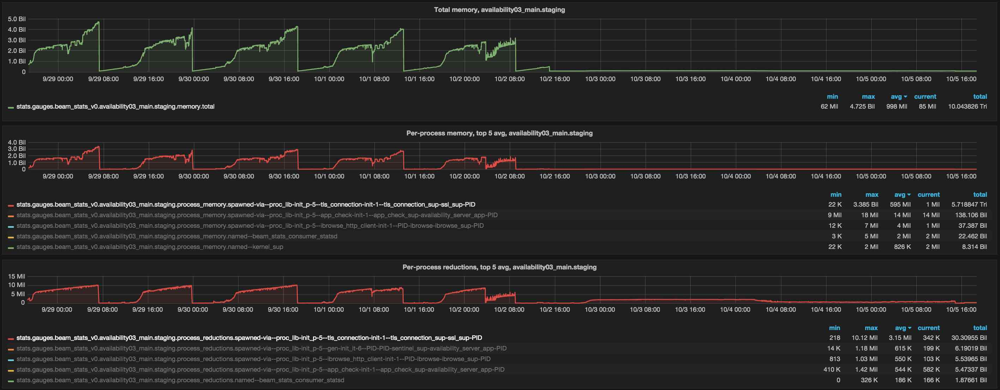

[](https://travis-ci.org/xandkar/beam_stats)

beam_stats
==========

Periodically collects and pushes VM metrics to arbitrary consumer processes,
which, in-turn, can do whatever they want with the given data (such as
serialize and forward to some time series storage). Includes, off by default,
example implementations of consumers for:

- StatsD (`beam_stats_consumer_statsd`)
- Graphite (`beam_stats_consumer_graphite`)
- CSV file (`beam_stats_consumer_csv`)

Essentially like `folsomite`, but different. Different in the following ways:

- More-general: consumers other than graphite can be defined
- More-focused: only concerned with VM metrics, while `folsomite` ships off
  _everything_ from `folsom` (in addition to VM metrics)
- Easier-(for me!)-to-reason-about implementation:
    + Well-defined metrics-to-binary conversions, as opposed to the
      nearly-arbitrary term-to-string conversions used in `folsomite`
    + Spec'd, tested and Dialyzed
- More detailed stats:
    - **per-process**. As much process ancestry is collected as possible, then
      anonymous processes are aggregated to their youngest-known, named
      predecessor - this aggregation keeps the useful breadcrumbs, while
      reducing the number of unique names from exploding, which
      **avoids the associated problems**:
        1. not very useful when there're lots of short-lived processes
        2. exploading disk space usage in Whisper
    - per-ETS-table
    - and more ... see records defined in `include` directory

For an example of using pre-process stats to track-down memory leaks, here's a
screenshot of the SSL connection process memory usage growth drop after upgrade
from 17.5 to 18.1 (back in 2015):


### Adding consumers

#### At app config time

```erlang
{env,
  [ {production_interval , 30000}
  , {consumers,
      [ {beam_stats_consumer_statsd,
          [ {consumption_interval , 60000}
          , {dst_host             , "localhost"}
          , {dst_port             , 8125}
          , {src_port             , 8124}
          , {num_msgs_per_packet  , 10}

          % If you want to name your node something other than what
          % erlang:node() returns:
          , {static_node_name     , <<"unicorn_at_rainbow">>}
          ]}
      , {beam_stats_consumer_graphite,
          [ {consumption_interval , 60000}
          , {host                 , "localhost"}
          , {port                 , 2003}
          , {timeout              , 5000}
          ]}
      , {beam_stats_consumer_csv,
          [ {consumption_interval , 60000}
          , {path                 , "beam_stats.csv"}
          ]}
      , {some_custom_consumer_module,
          [ {some_custom_option_a, "abc"}
          , {some_custom_option_b, 123}
          ]}

      ]}
  ]}
```

#### Dynamically

```erlang
beam_stats_consumer:add(consumer_module, ConsumerOptions).
```

### Removing consumers

Not yet implemented.
